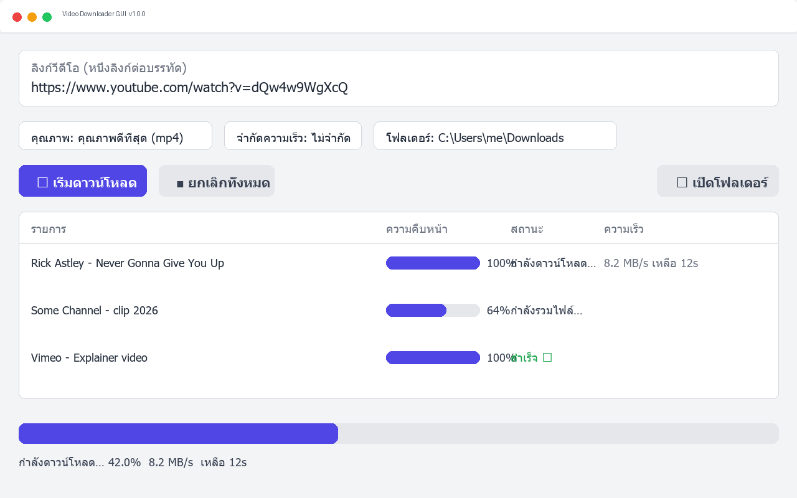

# Video Downloader GUI


[](https://github.com/NarDecH/video-downloader-gui/releases/latest)
[](../LICENSE)
[](https://github.com/NarDecH/video-downloader-gui/releases/latest)

แอป GUI บน Windows สำหรับ **ดาวน์โหลดวีดีโอจากเว็บไซต์สาธารณะ** (YouTube, TikTok, Facebook, X/Twitter, Vimeo และอีกหลายพันเว็บไซต์) โดยใช้ [yt-dlp](https://github.com/yt-dlp/yt-dlp) เป็นเอนจินหลัก

**ดาวน์โหลดไฟล์ EXE ล่าสุด:** [หน้าเว็บดาวน์โหลด](https://nardech.github.io/video-downloader-gui/) • [GitHub Releases](https://github.com/NarDecH/video-downloader-gui/releases/latest)

---

## ✨ ฟีเจอร์

- 🖥️ **ใช้งานง่าย** — วางลิงก์ (รองรับหลายลิงก์พร้อมกัน) เลือกคุณภาพ กดปุ่มเดียวจบ
- 🎚️ **เลือกคุณภาพได้** — ดีที่สุด / 1080p / 720p / 480p / แยกเสียงเป็น MP3
- 📊 **แสดงความคืบหน้า** — เปอร์เซ็นต์ ความเร็ว และเวลาที่เหลือแบบเรียลไทม์
- ⏹️ **ยกเลิกได้ทุกเมื่อ** — ปุ่มยกเลิกหยุดงานทันทีอย่างปลอดภัย
- 🚫 **จำกัดความเร็ว** — กันกินแบนด์วิดท์ทั้งเครือข่าย (1/5/10 MB/s)
- 📦 **ไฟล์เดียวจบ** — EXE แพ็ก ffmpeg มาให้แล้ว **ผู้ใช้ไม่ต้องติดตั้ง Python หรือโปรแกรมเพิ่ม**

## 🖼️ หน้าตาโปรแกรม



## 🚀 เริ่มใช้งาน (ผู้ใช้ทั่วไป)

1. ไปที่ [หน้าเว็บดาวน์โหลด](https://nardech.github.io/video-downloader-gui/) หรือ [Releases](https://github.com/NarDecH/video-downloader-gui/releases/latest)
2. กดดาวน์โหลด `VideoDownloaderGUI.exe`
3. (แนะนำ) ตรวจ SHA256 ของไฟล์กับค่าที่แสดงบนหน้าเว็บ:
   ```powershell
   Get-FileHash .\VideoDownloaderGUI.exe -Algorithm SHA256
   ```
4. ดับเบิลคลิกเปิดโปรแกรม วางลิงก์ เลือกโฟลเดอร์ กด **เริ่มดาวน์โหลด**

> ⚠️ ถ้า Windows SmartScreen เตือน ให้กด "More info" → "Run anyway" (เกิดจากไฟล์ EXE ยังไม่มี code signing certificate)

> 💡 เปิดครั้งแรกอาจช้า 2–5 วินาที เพราะ onefile แตกไฟล์ชั่วคราว — ครั้งต่อไปจะเร็วขึ้น

## 🛠️ สำหรับนักพัฒนา

```bash
git clone https://github.com/NarDecH/video-downloader-gui.git
cd video-downloader-gui
python -m pip install -r requirements.txt

python main.py                                    # รันจากซอร์ส
python -m PyInstaller --clean --noconfirm VideoDownloaderGUI.spec   # แพ็ก EXE
```

ต้องการ Python 3.13+ (พัฒนาและทดสอบบน 3.14) — ดูรายละเอียดสถาปัตยกรรมได้ที่ [RESEARCH](RESEARCH.md) และคู่มือ contributor/AI agent ที่ [AGENT.md](../AGENT.md)

## 📚 เอกสารทั้งหมด

| เอกสาร | Markdown | HTML |
|---|---|---|
| README (เอกสารนี้) | [README.md](README.md) | [README.html](README.html) |
| Research (เทคนิค/ทางเลือก) | [RESEARCH.md](RESEARCH.md) | [RESEARCH.html](RESEARCH.html) |
| Changelog | [CHANGELOG.md](CHANGELOG.md) | [CHANGELOG.html](CHANGELOG.html) |
| Agent guide | [AGENT.md](../AGENT.md) | — |

## ⚖️ การใช้งานอย่างรับผิดชอบ

โปรแกรมนี้เป็นเครื่องมือทั่วไปสำหรับคอนเทนต์**สาธารณะ**เท่านั้น โปรด:

- ดาวน์โหลดเฉพาะเนื้อหาที่คุณมีสิทธิ์ หรืออยู่ภายใต้ข้อยกเว้นการใช้งานโดยชอบของกฎหมายท้องถิ่น
- เคารพ[ข้อกำหนดการใช้งาน](https://www.youtube.com/t/terms)ของแต่ละแพลตฟอร์ม
- **ไม่**ใช้เพื่อละเมิดลิขสิทธิ์ หรือเผยแพร่คอนเทนต์ส่วนบุคคลที่เจ้าของไม่ได้ยินยอม

ผู้ใช้และผู้ใช้งานรับผิดชอบการใช้งานของตนเอง ซอฟต์แวร์เผยแพร่ภายใต้[สัญญาอนุญาต MIT](../LICENSE)

## 🙏 เครดิต

- [yt-dlp](https://github.com/yt-dlp/yt-dlp) — เอนจินดาวน์โหลดหลัก (Unlicense)
- [imageio-ffmpeg](https://pypi.org/project/imageio-ffmpeg/) — ffmpeg binary สำหรับการรวมไฟล์
- [PyInstaller](https://pyinstaller.org/) — แพ็กเป็น EXE ไฟล์เดียว
